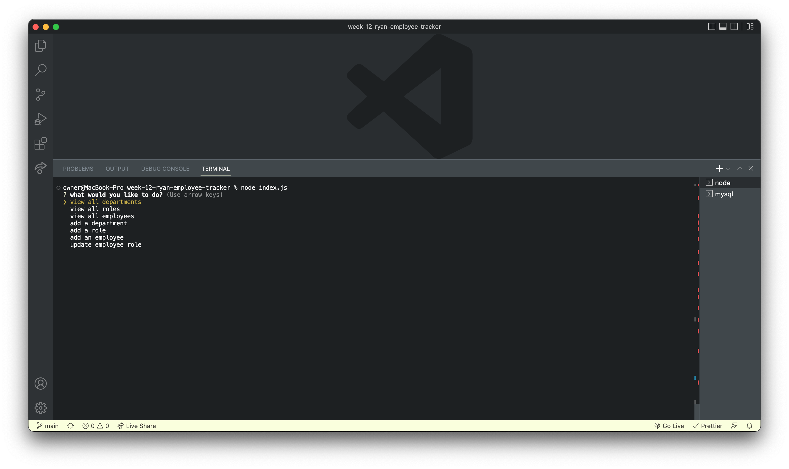

# week-12-ryan-employee-tracker

## Description

Using the recent lesson on MySQL, I made a command line application for displaying tables for a company to track their employees. I made a databse and three tables for storing the data for the employees. I then used inquirer to display the tables and also add content to the tables form the user input.

## Installation

Link to the video showing the app functioning

## Usage

After running node index.js in the terminal, answer the inquierer question to display or add content to the tables in the employee database.

